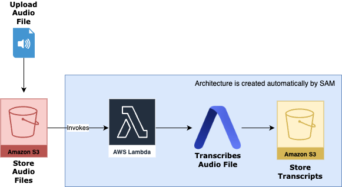

# AssemblyAI's AWS SAM Template 🧰

This project provides a serverless audio transcription service built using AWS SAM (Serverless Application Model) and AssemblyAI. When audio files are uploaded to an S3 bucket, they are automatically transcribed using AssemblyAI's async speech-to-text API, and the resulting transcripts are stored in a separate S3 bucket.

## Architecture



The service uses the following AWS components:
- **Amazon S3**: Two buckets are used - one for audio files and another for transcripts
- **AWS Lambda**: Processes S3 events and coordinates with the AssemblyAI API
- **AWS SAM**: Infrastructure as Code (IaC) for easy deployment

## Prerequisites

1. **AWS Account**: You need an AWS account and appropriate permissions to create resources
2. **AWS SAM CLI**: Install the AWS SAM CLI by following the [official guide](https://docs.aws.amazon.com/serverless-application-model/latest/developerguide/serverless-sam-cli-install.html)
3. **Python 3.13**: The Lambda function uses Python 3.13
4. **AssemblyAI API Key**: Sign up at [AssemblyAI](https://www.assemblyai.com/) to get your API key

## Installation

1. Clone this repository:
   ```bash
   git clone [repository-url]
   cd AAI-AWS-SAM-Template
   ```

2. Install dependencies:
   ```bash
   cd lambdas
   pip install -r requirements.txt
   ```

## Deployment

1. Deploy the application using SAM:
   ```bash
   sam deploy --guided
   ```

2. During the guided deployment, you'll be asked for:
   - Stack Name: Choose a name for your CloudFormation stack
   - AWS Region: Choose your desired AWS region
   - AssemblyAI API Key: Enter your AssemblyAI API key
   - ExistingAudioBucketName: (Optional) Leave empty to create a new bucket, or provide an existing bucket name
   - Confirm changes before deploy: Recommended to say yes
   - Allow SAM CLI IAM role creation: Must be yes
   - Save arguments to configuration file: Recommended to say yes

   Note: If you don't provide an existing bucket name, the template will automatically create a new S3 bucket for your audio files.

## Usage

1. After deployment, you'll have two S3 buckets:
   - `{stack-name}-audio-files`: Upload your audio files here (if using new bucket)
   - `{stack-name}-transcripts`: Transcripts will appear here

2. To transcribe an audio file:
   - Upload an audio file to the audio bucket
   - The Lambda function will automatically process it
   - Find the transcript in the transcripts bucket with the same name (but .txt extension)

## Testing

The project includes both unit and integration tests:

```bash
cd tests
pip install -r requirements.txt
python -m pytest
```

## Monitoring and Logs

- View Lambda function logs in CloudWatch Logs
- Monitor S3 bucket events in CloudWatch Events
- Track AssemblyAI transcription status in Lambda logs

## Cleanup

To remove all resources created by this application:

```bash
sam delete
```

## Contributing

Contributions are welcome! Please feel free to submit a Pull Request.

## Support

If you encounter any issues or have questions, please open an issue in the GitHub repository or contact support@assemblyai.com.
